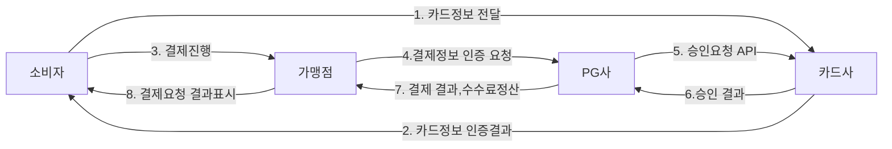

# payment-api-webclient-exception-handling

> 본사 CRM에서는 전문통신 방식을 위해 기존 RestTemplate에 암호화/복호화를 쓰고 있었지만, 프레임워크를 새로 구축하면서 WebClient로 바꾸는 과정을 가졌다.  
> 옛날 쇼핑몰에서 박효신 티켓 구매 후 결제 시, 타임아웃이 걸렸는지 결제 응답이 없어 곤란했던 적을 바탕으로 만들어보는 API  
> WebClient와 최대한의 Exception handling (타임아웃)을 가진 결제 API 모색해보기 
>
> > #### 목표
> >
> > 결제 프로세스를 이해하고 실제 예외 상황을 잘 처리 해보는 결제 API를 구축
> > Spring 5.0 이후 부터는 spring에서 권고 하는 WebClient 모듈을 이해하고 응용해보기

## ▶ 분석

1. **온라인 결제 프로세스**

이 문서는 다음의 출처를 참고하였습니다:

- [IAMPORT Manual - 인증결제 배경](https://github.com/iamport/iamport-manual/blob/master/%EC%9D%B8%EC%A6%9D%EA%B2%B0%EC%A0%9C/background.md)

  - 한국에서는 카드사, 일부 PG사를 제외하고는 카드 정보를 저장할 수 없도록 규정되어 있기 때문에 1,2번 과정이 꼭 필요하다.
  - 결제 통신은 **가맹정 서버와 PG사 서버간**에 이루어진다.
  - 이 통신 과정에서 가맹점은 PG 사에게 2번 정보를 PG사로 전송하고 PG사는 카드사로부터 전달된 인증키와 함께 카드사로 승인 요청을 진행 한다.
  - 실제 카드사에서 결제 승인에 판단이 이루어 진다. ( 한도초과/분실카드 등의 상유로 결제 실패 )

2. **서버와 서버의 통신**

   - Spring 혹은 자바에서는 서버간의 HTTP 통신을 위해 java.net 패키지의 HttpURLConnection, Spring의 RestTemplate, Spring WebFlux의 WebClient 등이 있다.

   - **왜 WebClient 인가?**
     - ## 동기와 비동기의 차이점
       - 동기는 Http 요청 후 응답이 올 때 까지 소스가 흘러가지 않는다. 단일 스레드 흐름으로 처리되기에 간단한 디버깅에는 요청 후 즉시 결과를 처리하기에 너무 유용하다. 다만 수 많은 동시 요청이 있을 경우 시스템이 자원이 금방 소모 된다.
       - 비동기는 Http 요청 후 응답이 올 때 소스가 흘러가며 응답은 콜백으로 처리를 한다. 멀티 스레드 흐름으로 처리 되기에 수 많은 동시 요청 수용이 가능하다.
       - **"동기 방식이 안좋다"는 절대 아니다** 단순 파일 읽고 쓰기 같은 처리에는 동기 방식이 효율적이다. 하지만 결제 서비스는 동시 요청이 많은 서비스 이다 보니 비동기 처리로 선택이 맞다고 생각한다.
     - ## 쓰레드 블로킹 방식과 논블로킹의 방식
       - 쓰레드가 블로킹 방식이면 응답이 올 때 까지, 쓰레드가 대기한다. RestTemplate은 블로킹 방식에 해당한다. 즉, 클라이언트가 요청을 보내면 응답을 받을 때까지 대기한다. 소규모 CRM 프로젝트에서는 유용하게 쓰일지 몰라도 사용자가 많이 사용하게 되면 자원 낭비가 발생 할거라 생각한다.
       - 쓰레드가 논블로킹 방식이라면 현재 쓰레드가 대기하지 않고 다른 작업을 수행 할 수 있다. 특히 나 대규모 트래픽을 고려한다면 결제 서비스에는 맞춤일거라 생각한다.
       - **WebClient는 비동기 및 논블로킹 방식을 기본으로, 동기 방식도 지원한다** 이에 따라 서비스 종류 마다 유연하게 대처가 가능하고 확장성이 강하다 생각했다.
