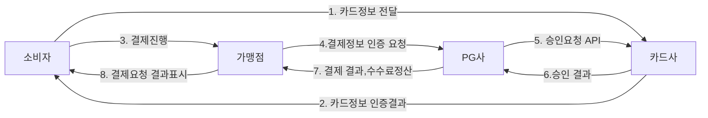

# payment-api-webclient-exception-handling

> WebClient와 최대한의 Exception handling (타임아웃)을 가진 결제 API 공부해보기 
> 옛날 쇼핑몰에서 박효신 티켓 구매 후 결제 시, 타임아웃이 걸렸는지 결제 응답이 없어 곤란했던 적을 바탕으로 만들어보는 프로젝트  
>
> > #### 목표
> >
> > 결제 프로세스를 이해하고 실제 예외 상황을 잘 처리 해보는 결제 API를 구축
> > Spring 5.0 이후 부터는 spring에서 권고 하는 WebClient 모듈을 이해하고 응용해보기

## ▶ 분석

1. **온라인 결제 프로세스**

